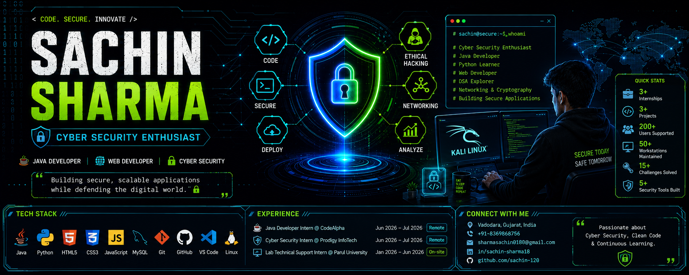

<p align="center">
  
</p>

<h1 align="center">Hi 👋, I'm Sachin Santosh Sharma</h1>

<h3 align="center">
🔐 Cyber Security Enthusiast &nbsp;|&nbsp; ☕ Java Developer &nbsp;|&nbsp; 🌐 Web Developer
</h3>

<p align="center">

</p>

<p align="center">


</p>

<!-- TERMINAL INTRO -->
<p align="center">

</p>

<p align="center">
<a href="mailto:sharmasachin0180@gmail.com"></a>
<a href="https://linkedin.com/in/sachin-santosh-sharma-b93345404"></a>
<a href="tel:+918369868756"></a>
</p>


<!-- ================= ABOUT ================= -->
# 👨‍💻 About Me

```yaml
Name: Sachin Santosh Sharma
Education: B.Tech, Computer Science Engineering (Cyber Security) (Expected 2028)
University: Parul University, Vadodara, India
Focus: Cyber Security + Java/Web Development
Internships Completed: 3 (Lab Tech Support, Java Development, Cyber Security)
Job Simulations: Datacom (Cyber Security Operations), NY Jobs CEO Council (Cybersecurity)
Currently Exploring: Network Fundamentals · Cryptography · Web Application Security · Burp Suite
Goal:
  Become a skilled Cyber Security Professional
```

- 🔭 Currently building secure applications and exploring Web Application Security with Burp Suite
- 🛡️ Strengthening skills in Cryptography, Network Fundamentals & Secure Coding Practices
- 🤝 Open to collaborating on Java / Python / Web Security projects
- 💬 Ask me about Caesar Ciphers, OOP in Java, REST APIs, or phishing/IOC analysis
- 😄 Fun fact: I once spent an afternoon decrypting my own Caesar Cipher because I forgot the shift value
- 📫 Fastest way to reach me: **sharmasachin0180@gmail.com**

<p align="center">

---

</p>

<!-- ================= EDUCATION ================= -->
# 🎓 Education

<table align="center">
<tr><th>Degree</th><th>Institution</th><th>Score</th><th>Year</th></tr>
<tr><td>B.Tech – Computer Science Engineering (Cyber Security)</td><td>Parul University, Vadodara</td><td>CGPA: 8.07/10.0 (through Sem 3)</td><td>Expected 2028</td></tr>
<tr><td>HSC – Science (PCM)</td><td>Maharashtra State Board</td><td>76.17%</td><td>Feb 2024</td></tr>
<tr><td>SSC</td><td>Maharashtra State Board</td><td>82.00%</td><td>Mar 2022</td></tr>
</table>

<p align="center">

---

</p>

<!-- ================= EXPERIENCE TIMELINE ================= -->
# 💼 Experience Timeline

```
2026 ─┬─ 🖥️ Lab Technical Support Intern · System Support Cell, Parul University (Hardware/software diagnostics)
      ├─ ☕ Java Developer Intern · CodeAlpha                                     (OOP applications, algorithms)
      └─ 🔐 Cyber Security Intern · Prodigy InfoTech                              (Python security tools, cryptography)
```

<details open>
<summary><b>🖥️ Lab Technical Support Intern — System Support Cell, Parul University (Vadodara, India) · January 2026 – June 2026</b></summary>
<br>

- Diagnosed and resolved hardware, software, and peripheral issues across 50+ lab workstations, reducing average system downtime
- Installed and configured operating systems and essential applications for students and faculty, supporting 200+ end users
- Performed routine system updates, hardware diagnostics, and basic network troubleshooting to maintain uninterrupted laboratory operations
</details>

<details>
<summary><b>☕ Java Developer Intern — CodeAlpha (Remote) · June 2026 – July 2026</b></summary>
<br>

- Developed and delivered functional Java applications applying OOP principles (encapsulation, inheritance, polymorphism) within defined project timelines
- Solved 15+ algorithmic programming challenges to strengthen data structures and Java fundamentals
- Received mentorship-driven feedback to iteratively improve code quality and software design practices
</details>

<details>
<summary><b>🔐 Cyber Security Intern — Prodigy InfoTech (Remote) · June 2026 – July 2026</b></summary>
<br>

- Built Python-based cybersecurity tools incorporating secure coding principles and classical cryptographic techniques, including a fully functional Caesar Cipher encryption/decryption application
- Maintained structured Git repositories with consistent commit history and version control best practices across all project deliverables
- Authored technical documentation and project reports communicating security concepts and implementation details to both technical and non-technical audiences
</details>

<p align="center">

---

</p>

<!-- ================= TECH STACK ================= -->
# ⚡ Tech Stack

<p align="center">

</p>

<p align="center">

</p>

### 🛠️ Skill Proficiency
<p align="center">


<br>


<br>


</p>

### 🔐 Cyber Security Domains
<p align="center">


</p>

<p align="center">

---

</p>

<!-- ================= PROJECTS ================= -->
# 🚀 Featured Projects

<table align="center">
<tr>
<td width="50%" valign="top">

### 🔐 Caesar Cipher Encryption Tool
`Python`
- CLI encryption/decryption application implementing the Caesar Cipher algorithm with configurable shift values
- Applied Python string manipulation and modular algorithm design supporting both encoding and decoding workflows

</td>
<td width="50%" valign="top">

### 🌐 Async Weather Dashboard
`JavaScript · HTML5 · CSS3 · REST API`
- Responsive dashboard consuming a third-party REST API via Fetch + Async/Await for real-time weather data
- Structured error handling and adaptive CSS layouts for consistent rendering across devices

</td>
</tr>
<tr>
<td width="50%" valign="top">

### 🌐 Task Manager Application
`JavaScript · HTML5 · CSS3 · LocalStorage`
- Browser-based task manager with full CRUD operations and LocalStorage persistence
- Dynamic DOM manipulation for real-time UI updates without page reloads

</td>
<td width="50%" valign="top">

### 🖥️ Lab Systems Support
`Hardware · OS Config · Networking`
- Diagnosed and resolved issues across 50+ lab workstations supporting 200+ end users
- Performed OS installation, configuration, and basic network troubleshooting

</td>
</tr>
</table>

<p align="center">

---

</p>

<!-- ================= CERTIFICATIONS ================= -->
# 📜 Certifications & Programs

<p align="center">


</p>

| Certificate | Provider |
|---|---|
| 🏆 Cyber Security Operations Job Simulation | Datacom via Forage (Jan 2026) |
| 🏆 Cybersecurity Job Simulation | New York Jobs CEO Council via Forage (Jan 2026) |
| 📄 Cyber Security Internship Certificate | Prodigy InfoTech (Jun–Jul 2026) |
| 📄 Java Developer Internship Certificate | CodeAlpha (Jun–Jul 2026) |
| 📄 Lab Technical Support Certificate | System Support Cell, Parul University (Jan–May 2026) |

<p align="center">

---

</p>

<!-- ================= GITHUB STATS ================= -->
# 📊 GitHub Stats

<p align="center">


</p>

<p align="center">
  
</p>

<p align="center">

</p>

<p align="center">

---

</p>

<!-- ================= QUOTE + SNAKE ================= -->
<p align="center">

</p>

<p align="center">

</p>

<p align="center">

---

</p>

<!-- ================= CONNECT ================= -->
# 📫 Connect With Me

<p align="center">
<a href="mailto:sharmasachin0180@gmail.com"></a>
<a href="https://github.com/sachin-120"></a>
<a href="https://linkedin.com/in/sachin-santosh-sharma-b93345404"></a>
</p>

<p align="center">
⭐ Always Learning &nbsp;•&nbsp; Always Building &nbsp;•&nbsp; Always Securing ⭐
</p>


